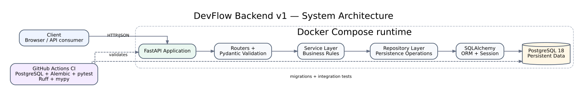

# DevFlow

**DevFlow** is a production-oriented issue and project management platform built as a portfolio-grade backend engineering project.

The project is designed to demonstrate practical skills relevant to Python/backend development, software engineering internships, working-student roles, and QA/test automation.

## Project goals

DevFlow is intentionally built like a real engineering product rather than a tutorial application.

The backend v1 demonstrates:

- REST API design with FastAPI
- PostgreSQL data modelling with SQLAlchemy
- Alembic database migrations
- Repository and service-layer architecture
- JWT authentication and authorization
- Organization membership and role-based access
- Project, issue, comment, and label workflows
- Automated unit, route, and PostgreSQL integration testing
- Dockerized local infrastructure
- GitHub Actions CI
- Ruff, mypy, pytest, and pre-commit quality gates
- Engineering documentation and pull-request-based development

Features such as Redis, background workers, notifications, object storage, audit logs, and advanced search are intentionally reserved for future versions.

## Architecture

DevFlow is implemented as a **modular monolith**.

```text
Client
  ↓
FastAPI
  ↓
Router
  ↓
Service
  ↓
Repository
  ↓
SQLAlchemy
  ↓
PostgreSQL
```

Detailed architecture documentation lives in `docs/architecture/`.



## Documentation

- [Architecture](docs/architecture/overview.md)
- [Database design](docs/database/database-design.md)
- [Engineering workflow](docs/planning/engineering-workflow.md)
- [Architecture decisions](docs/decisions/)

## Current status

**Backend v1: Complete.**

## Local infrastructure

The FastAPI application and PostgreSQL database can run together with Docker Compose:

```bash
docker compose up --build
```

The API is available at:

```text
http://localhost:8000
```

Health endpoints:

```text
GET /health
GET /ready
```

## Quality and CI

Backend changes are validated using:

- PostgreSQL 18
- Alembic migrations against a clean database
- pytest
- real PostgreSQL integration testing
- Ruff linting
- Ruff formatting checks
- mypy
- pre-commit hooks

GitHub Actions runs the backend quality gates for backend changes.

## Development principle

```text
Requirement
→ GitHub Issue
→ Design
→ Branch
→ Implementation
→ Tests
→ Pull Request
→ CI
→ Merge
→ Documentation
```

