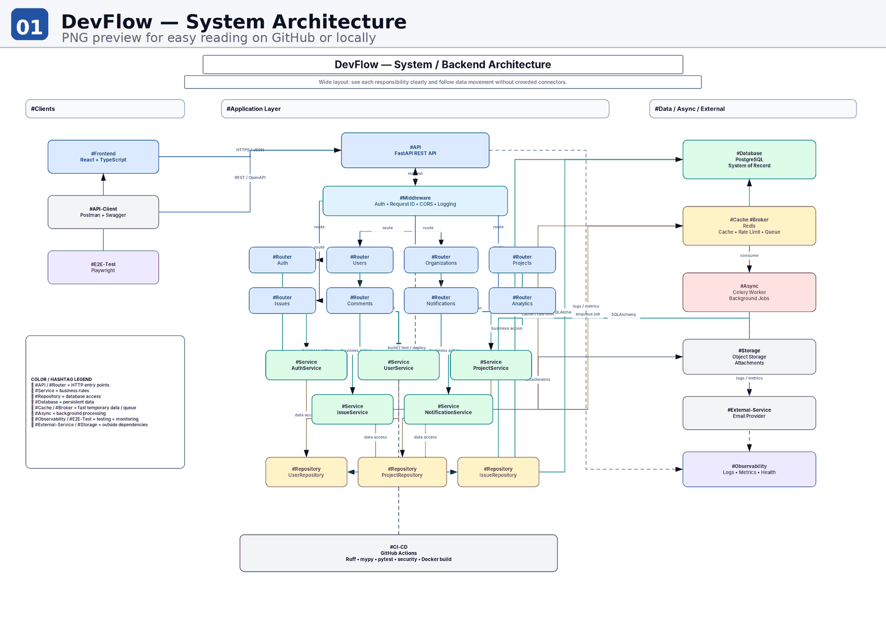
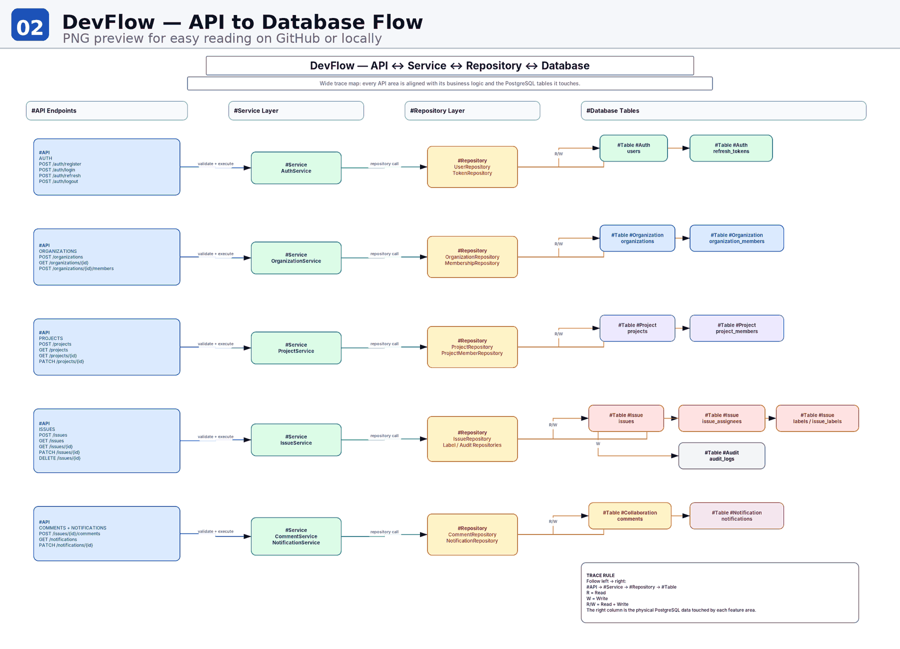

# Architecture Overview

DevFlow is initially designed as a **modular monolith**.

## Why a modular monolith?

The application needs clear domain boundaries but does not currently require independently deployable services. This keeps deployment and local development simple while preserving separation between authentication, users, organizations, projects, issues, comments, and notifications.

## Backend layering

```text
HTTP Request
    ↓
Router
    ↓
Schema Validation
    ↓
Service
    ↓
Repository
    ↓
PostgreSQL
```

- **Router** owns HTTP concerns.
- **Service** owns business rules and use-case orchestration.
- **Repository** owns persistence operations.
- **PostgreSQL** is the persistent source of truth.

Later phases add Redis, background workers, object storage, observability, and CI/CD.


## System architecture



## API to database flow



The editable source files remain available beside each PNG as `.drawio` files.
