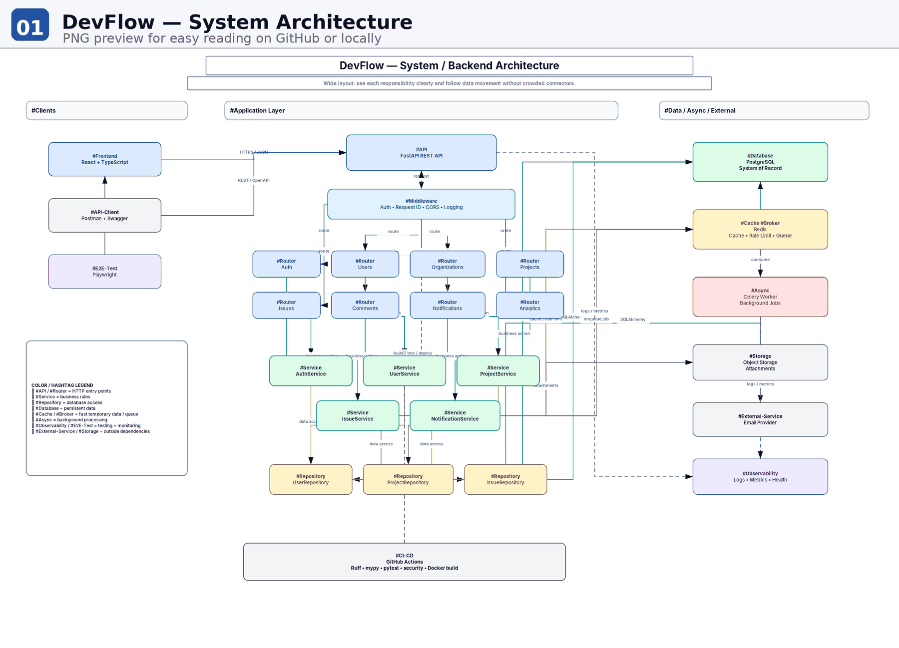
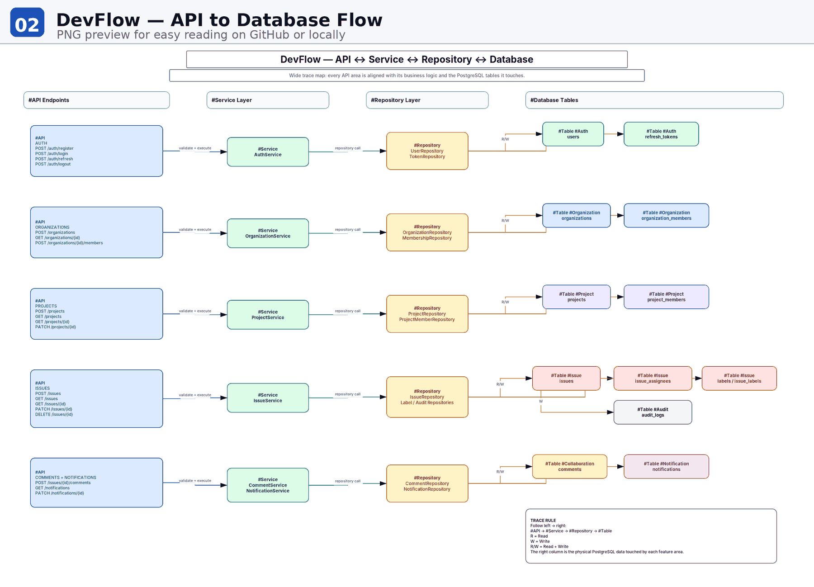

# Architecture Overview

DevFlow backend v1 is implemented as a **modular monolith**.

## Why a modular monolith?

The application has clear domain boundaries but does not require independently deployable services.

This keeps deployment and local development simple while preserving separation between:

- authentication
- users
- organizations and memberships
- projects
- issues
- comments
- labels

## Backend layering

```text
HTTP Request
    ↓
Router
    ↓
Schema Validation
    ↓
Service
    ↓
Repository
    ↓
SQLAlchemy
    ↓
PostgreSQL
```

- **Router** owns HTTP concerns.
- **Schema validation** validates request and response data with Pydantic.
- **Service** owns business rules and use-case orchestration.
- **Repository** owns persistence operations.
- **SQLAlchemy** maps application models to relational persistence.
- **PostgreSQL** is the persistent source of truth.

## Runtime and delivery

The FastAPI application and PostgreSQL database can run together through Docker Compose.

GitHub Actions validates backend changes with:

- PostgreSQL 18
- Alembic migrations
- pytest
- PostgreSQL integration testing
- Ruff linting and formatting
- mypy

## Future scope

The following capabilities are intentionally outside backend v1:

- Redis
- background workers
- object storage and attachments
- notifications
- audit logs
- advanced search and pagination

## System architecture



## API to database flow



The editable source files remain available beside each PNG as `.drawio` files.