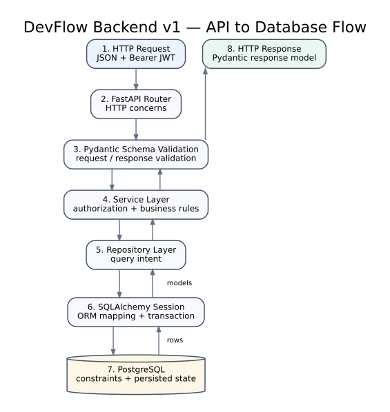

# Architecture Overview

DevFlow is implemented as a **modular monolith** with a separate React browser client.

## System shape

```text
Browser
  ↓
React + TypeScript
  ↓
HTTP / JSON
  ↓
FastAPI
  ↓
Router → Schema Validation → Service → Repository
  ↓
SQLAlchemy
  ↓
PostgreSQL
```

The backend keeps domain boundaries explicit without splitting them into independently deployed microservices.

## Backend domains

- authentication and users
- organizations and memberships
- organization invitations
- projects
- issues and assignees
- comments
- labels and issue-label assignments

## Layer responsibilities

- **Router** owns HTTP concerns and error/status mapping.
- **Schema validation** validates external request/response data with Pydantic.
- **Service** owns authorization, business rules, and use-case orchestration.
- **Repository** owns database queries and persistence.
- **SQLAlchemy** maps application models to relational persistence.
- **PostgreSQL** is the persistent source of truth.

Authorization is enforced in backend services. The frontend never acts as the security boundary.

## Runtime and delivery

Local Docker Compose runs PostgreSQL, FastAPI, and the Nginx-served React frontend as a full stack.

GitHub Actions validates changes with three layers:

- Backend CI: migrations, pytest, PostgreSQL integration, Ruff, mypy
- E2E CI: browser workflows against FastAPI + PostgreSQL
- Container CI: production-style Docker/Nginx routing, SPA deep links, readiness, and migration heads

## Future scope

The following capabilities remain intentionally outside the current version:

- Redis and background workers
- object storage and attachments
- outbound email delivery
- audit logs
- advanced search and pagination

## System architecture


## API to database flow



Editable diagram sources remain beside the SVG files as `.drawio` files.
