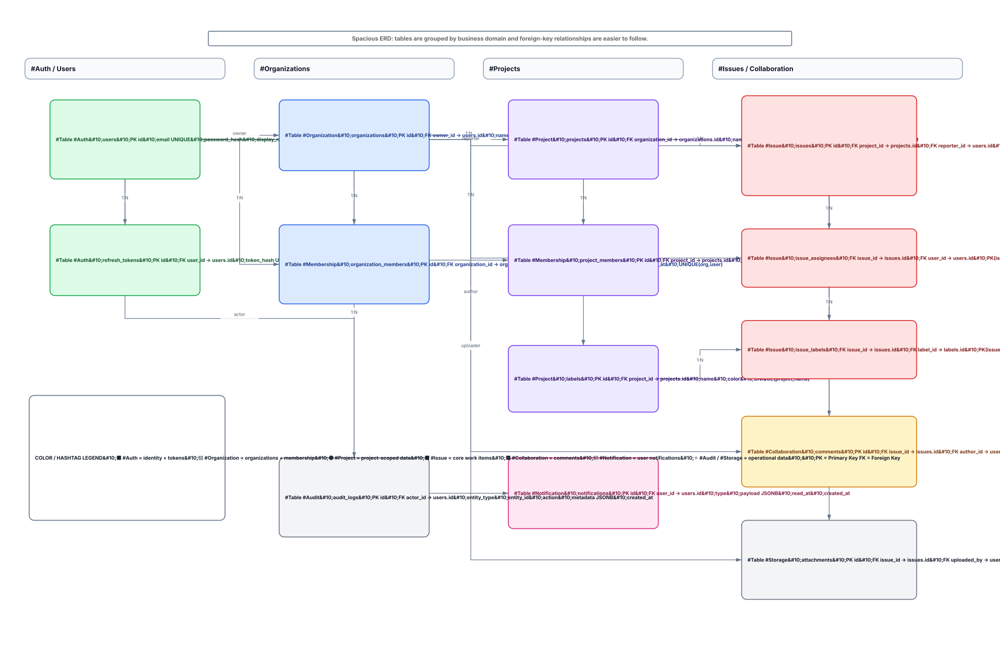

# Database Design

DevFlow uses PostgreSQL as its primary persistent data store.

## Main domains

### Authentication
- `users`
- `refresh_tokens`

### Organizations
- `organizations`
- `organization_members`

### Projects
- `projects`
- `project_members`
- `labels`

### Issues and collaboration
- `issues`
- `issue_assignees`
- `issue_labels`
- `comments`
- `attachments`

### Operational data
- `notifications`
- `audit_logs`

Foreign keys preserve relational integrity, join tables represent many-to-many relationships, and indexes will be added based on real access patterns and measured query needs.

## Entity relationship diagram

The editable source is stored in `database-erd.drawio`, and the DBML schema is stored in `schema.dbml`.
