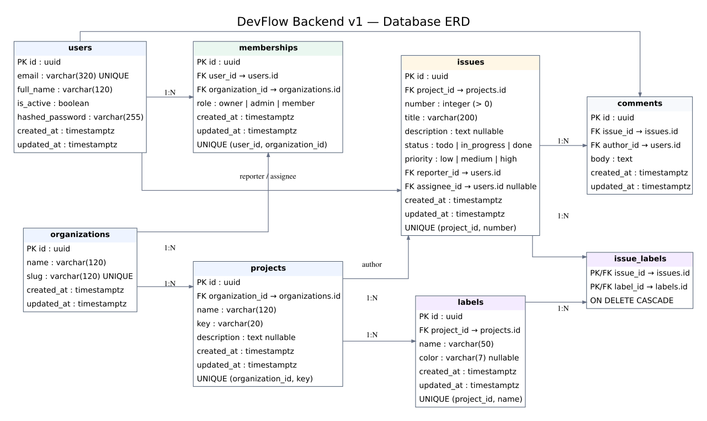

# Database Design

DevFlow backend v1 uses PostgreSQL as its persistent data store.

The database schema is managed through SQLAlchemy models and Alembic migrations.

## Main domains

### Users and authentication

- `users`

User passwords are stored as hashes. Authentication uses JWT access tokens; refresh-token persistence is not part of backend v1.

### Organizations and memberships

- `organizations`
- `memberships`

`memberships` represents the relationship between users and organizations.

Each membership has one of the following roles:

- `owner`
- `admin`
- `member`

A user can have only one membership per organization.

### Projects

- `projects`

Each project belongs to one organization.

Project keys are unique within their organization.

### Issues

- `issues`

Each issue belongs to one project and contains:

- a project-scoped sequential issue number
- title
- optional description
- status
- priority
- reporter
- optional assignee
- creation and update timestamps

Supported issue statuses:

- `todo`
- `in_progress`
- `done`

Supported priorities:

- `low`
- `medium`
- `high`

The combination of `project_id` and issue `number` is unique.

### Comments

- `comments`

Comments belong to issues and reference the user who authored them.

### Labels

- `labels`
- `issue_labels`

Labels are scoped to projects.

Label names are unique within each project.

`issue_labels` is the many-to-many join table between issues and labels.

## Current v1 tables

```text
users
organizations
memberships
projects
issues
comments
labels
issue_labels
```

Alembic also maintains:

```text
alembic_version
```

This table is migration metadata rather than an application domain table.

## Relationships

```text
users
  ├── memberships ── organizations
  ├── reported issues
  ├── assigned issues
  └── comments

organizations
  ├── memberships
  └── projects

projects
  ├── issues
  └── labels

issues
  ├── comments
  └── issue_labels ── labels
```

Foreign keys preserve relational integrity, while unique and check constraints enforce important domain rules at the database level.

## Entity relationship diagram



The editable source is stored in `database-erd.drawio`.

## Schema sources

The authoritative backend v1 schema is defined by:

1. SQLAlchemy models in `backend/app/models/`
2. Alembic migrations in `backend/migrations/`
3. `docs/database/schema.dbml`

The ERD above is a visual companion to these sources and reflects the current backend v1 tables and relationships.

## Future scope

The following database concepts are intentionally outside backend v1:

- refresh-token persistence
- project-specific membership tables
- multiple issue assignees
- attachments
- notifications
- audit logs