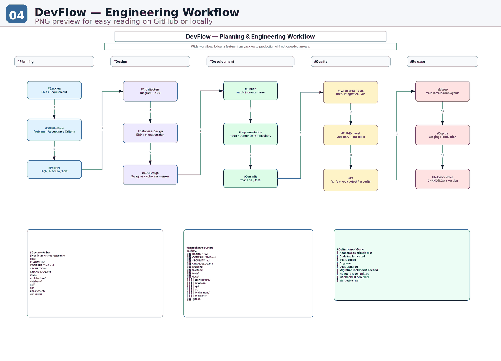

# Engineering Workflow

Each significant change follows:

```text
Backlog
→ GitHub Issue
→ Architecture / Database / API Design
→ Feature Branch
→ Implementation
→ Automated Tests
→ Pull Request
→ CI
→ Merge
→ Deployment / Release
```

`main` should remain deployable. Work happens on short-lived branches and merges only after required checks pass.


## Visual workflow



The editable source is stored in `engineering-workflow.drawio`.
